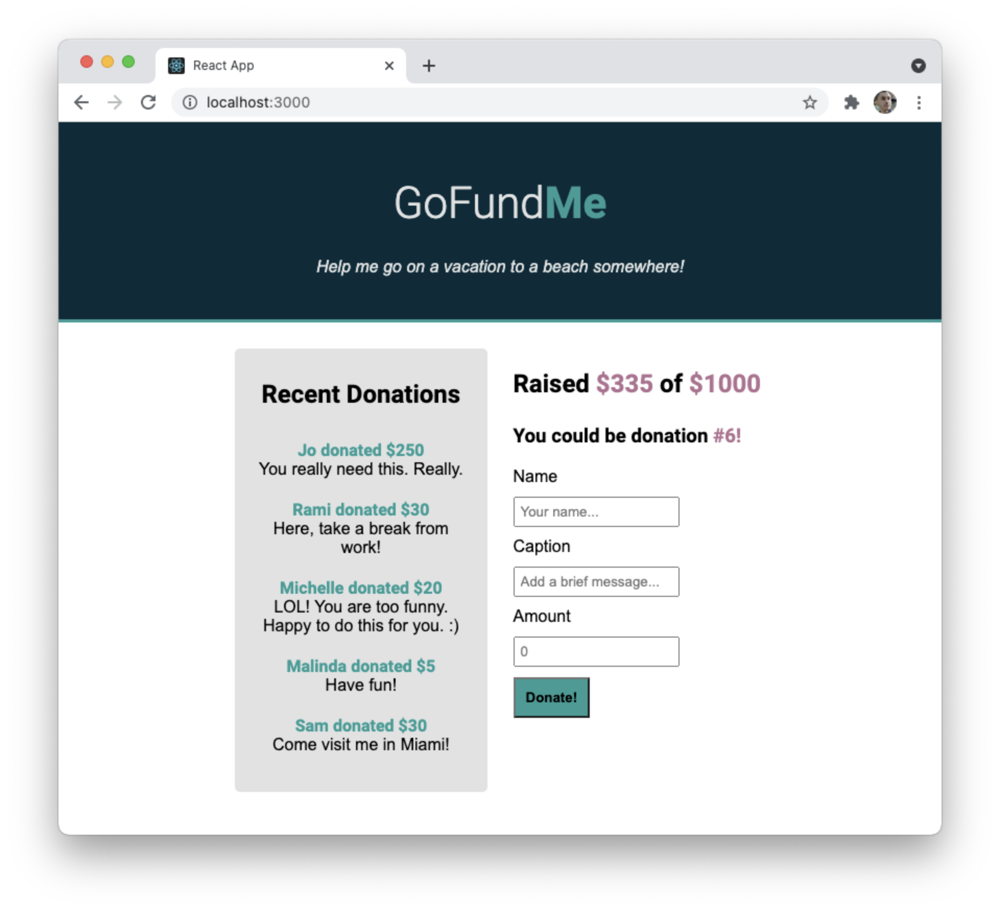

# React Props Lab

Pass props through multiple components to build a mockup of a "FundMe"-type website.



---

## Lab Setup

### Getting started

1. Fork and clone this repository.

1. Navigate to the cloned repository's directory on your command line. Then, run the following command:

   ```
   npm install
   ```

   This will install the libraries needed to run the tests.

1. Open up the repository in VSCode. Follow the instructions below to complete the Lab.

### Tests

To run the tests, you can run the following command from the command line. You will need to be in the root directory of your local directory.

```
npm test
```

This will open the Cypress testing window, where you can click to run an individual suite of tests or all of the tests at once.

#### Testing Tips

Keep the following in mind for this lab as you run the tests.

1. While running your tests, you must have a server up and running in another terminal. This means you will have _both_ a terminal window running the actual React application _and_ a terminal window running the tests.

1. When creating a component, make sure to create and import it with the same name as the file name. For example, the component created and exported inside of the `Post.js` file should be `Post`. The tests look for these specific names.

1. While the `cypress-watch-and-reload` package has been installed in this project, sometimes the React application will take longer to reload than the tests. If you feel as though a test should be passing that isn't, try pressing the re-run button in the Cypress tests before asking for help.

## Instructions

Inside of the `App.js` file are two variables which will serve as props for your application:

1. `targetAmount`: A number, in dollars, that represents the total amount of money attempting to be raised.

1. `donations`: An array of objects, where each object represents a donation.

Create each component in the `Components/` directory and pass props from the `App` to each components to create the mockup as seen above. HTML snippets for each component is included below.

### Components

Each of the components below must be completed and must make use of props. A "hardcoded" HTML snippet is included below so that you can focus on passing props as opposed to creating HTML. _Do not_ just copy and paste the HTML into the component and update the text. While this may pass the tests, it does not demonstrate you know anything about props.

#### DonationForm

For the donation form, you will need to update the sentence "You could be donation #1!" so that instead of being hardcoded to the number `1`, it is set to a number one above the number of donations.

```html
<section class="donation">
  <h3>You could be donation <span class="secondary">#1!</span></h3>
  <form>
    <label
      >Name<input
        id="name"
        name="name"
        type="text"
        placeholder="Your name..." /></label
    ><label
      >Caption<input
        id="caption"
        name="caption"
        type="text"
        placeholder="Add a brief message..." /></label
    ><label for="amount"
      >Amount<input
        id="amount"
        name="amount"
        type="number"
        placeholder="0" /></label
    ><button>Donate!</button>
  </form>
</section>
```

### Progress

For the progress section, you will need to replace the value `$0` with a dynamic value based on the donations.

```html
<section class="progress">
  <h2>
    Raised <span class="secondary">$0</span> of
    <span class="secondary">$1000</span>
  </h2>
</section>
```

### Recent Donations

For the recent donations section, you will need to have a number of `li` elements equal to the number of donations. Each `li` should include the person who donated, the amount, and their caption.

```html
<section>
  <h2>Recent Donations</h2>
  <ul>
    <li><span>Jo donated $25</span>You really need this. Really.</li>
    <li><span>Rami donated $10</span>Here, take a break from work!</li>
    <!-- etc... -->
  </ul>
</section>
```
